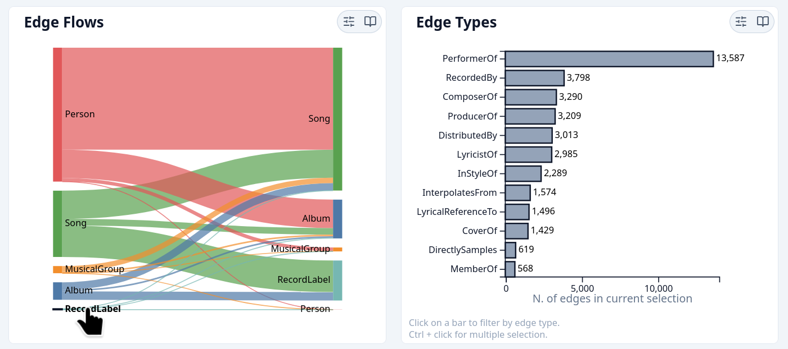
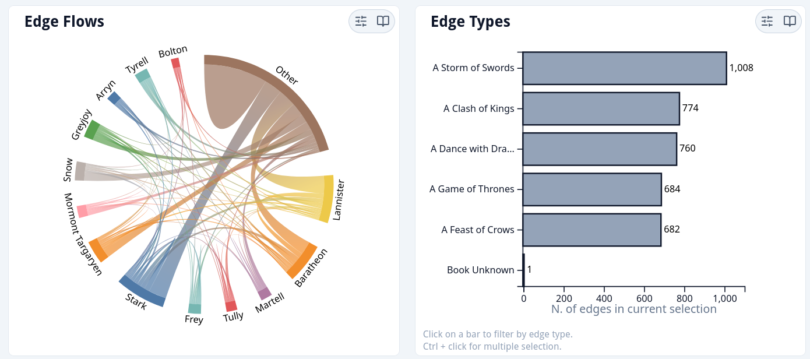
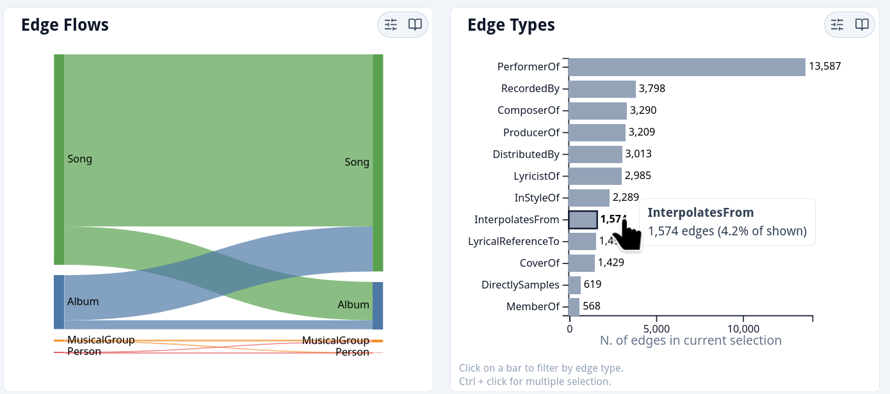
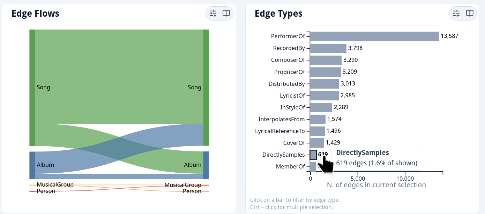
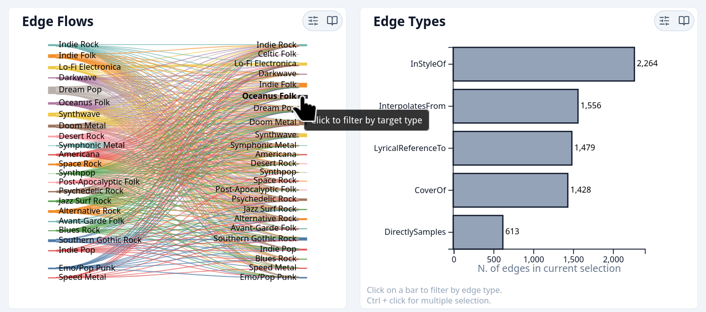
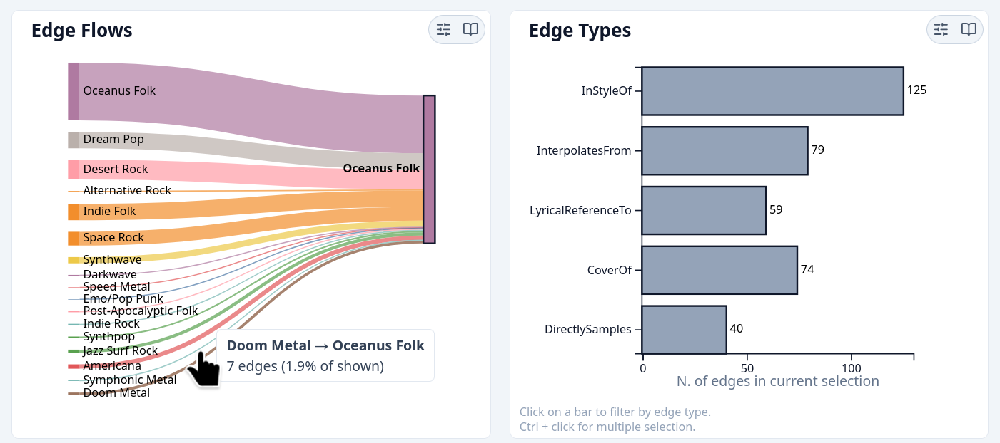
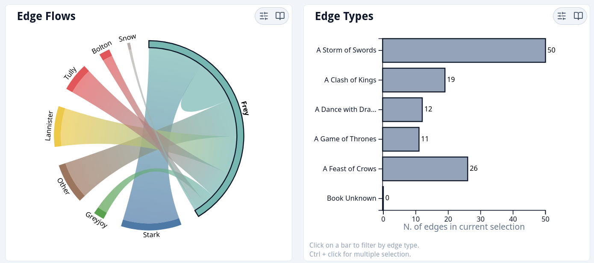
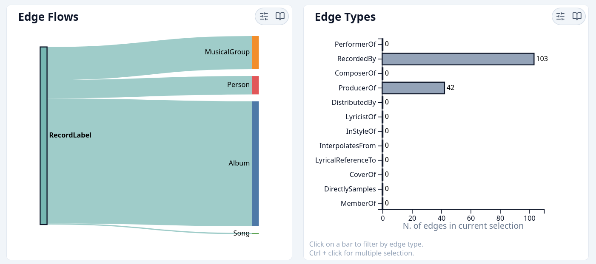
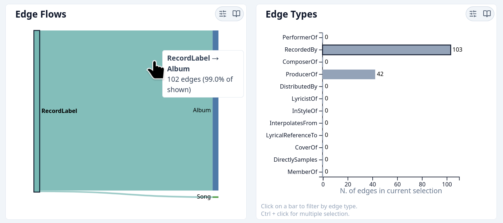

# Telescope Edge Overview

## Contents

- [Graph View](#graph-view)
- [Edge Overview panels](#edge-overview-panels)
  - [Edge Types panel](#edge-types-panel)
  - [Edge Flows panel](#edge-flows-panel)
  - [Animated transitions](#animated-transitions)
  - [Cross-panel contract](#cross-panel-contract)
- [User Walkthroughs](#user-walkthroughs)
  - [Infer edge types semantics](#infer-edge-type-semantics)
  - [Find edge types with similar semantics](#find-edge-types-with-similar-semantics)
  - [Find relevant information in a complex graph](#find-relevant-information-in-a-complex-graph)
  - [Finding anomalies](#finding-anomalies)

## Graph View

_Graph View_ is conceived as the starting point of the analysis of
Knowledge Graphs with rich and heterogeneous edge and node attributes
within the _Telescope_ application.

While _Guide view_ is centered around metrics, _Graph view_ aims to
provide the user with an overview of the dataset and allow them to drill
down on the analysis of interesting patterns. The visualization of
Knowledge graphs presents several challenges: first of all issues of
scale. Traditional visualization for graphs like node-link diagrams or
adjacency matrices rapidly become unmanageable: for this reason the core
loop of _Graph view_ is centered around filtering the dataset down to a
sub-graph that can be meaningfully analyzed visually.

_Guide View_ consists of three linked interactive visualizations:

1.  _Edge overview_: visualizing volume of flows between node types in
    the knowledge graph. It has affordances that allow the user to
    filter down the edges by edge type, source node type and target node
    type.

2.  _Node-link diagram_: visualizing the sub-graph induced on the
    current selection performed on the Edge overview. It allows the user
    to select a node for the ego network visualization.

3.  _Ego network_: visualizing the immediate context of a node (the
    'Ego') selected from the node-link diagram. The ego network is
    extracted from the original graph (not the induced sub-graph),
    meaning that all node and edge types are present.

The image shows a mockup of the proposed design in a
state corresponding to the endpoint of a plausible analysis performed on
the MC1 dataset of the 2025 VAST Challenge. Namely, the user is able to
detect a possible semantic inconsistency represented by a group of edges
of type `RecordedBy` with source of type `RecordLabel`. They are then
able to perform an in-depth analysis by visualizing the node-link
diagram of the filtered sub-graph (edges of type `RecordedBy` and source
of type `RecordLabel` and incident nodes) and --- at the level of local
relationships --- by visualizing the ego network of node 17370 (the
largest hub in the sub-graph). In this context, the role of the two
visualizations composing the _Edge overview_ is crucial in enabling
filtering down the starting graph by selecting only the edges the user
is interested in.

The image shows the wireframe of the layout
initially proposed for _Graph View_. Since the expected workflow would go like this:

1.  Filter to an interesting selection of edges using _Edge overview_;

2.  Inspect the _Node-link diagram_ and select the 'Ego';

3.  Inspect _Ego Network_

the vertical layout reflows the panels putting _Edge overview_ first.

The final implementation of _Graph View_ deviates from the original
design in order to keep the flexibility granted by the responsive grid
(with three, two, one columns) and the resizable panels used by
_Telescope_, while still having an opinionated layout intended to guide
the user's interaction. Differently from what happens in _Guide view_,
which emphasizes user's choice, no panel can be removed from _Graph
View_. In addition to that, only the _Node-link diagram_ and the _Ego
Network_ can be expanded, with one of the two always expanded. Like in
the original design, _Edge overview_ panels are displayed first in the
one-column layout, and, since these two panels should be used together,
some care was expended in making sure that they are always adjacent
(either on the same row or on the same column, depending on the case) in
any possible configuration.

## Edge overview panels

The panels in _Edge overview_ offer an aggregate representation of all
edges in the graph.

The design initially proposed for _Edge overview_ included a single
visualization: Parallel Sets on three
dimensions: source node type, edge type and target node type.

As can be
seen in the image, while this visualization could prove
suitable for graphs with a smaller number of node and edge types, it
quickly becomes cluttered and difficult to read. In addition to that,
the Parallel Sets impose a directional reading of flows that would be
inappropriate for undirected graph. This problem can be solved by using
an alternative visualization for edge flows volumes in undirected
graphs, but not while preserving a dimension for edge types.

A possible advantage of the initial design with respect to the current
implementation was that it enabled a more immediate comparison between
edge types, allowing the user to determine which edge types had similar
routes --- provided the visualization was legible at all. The current
visualization leverages animated transitions in order to ease comparison
of different edge types.

<figure id="img:overview">
<figure id="img:overview_directed">

<figcaption>Directed graphs.</figcaption>
</figure>
<figure id="img:overview_undirected">

<figcaption>Undirected graphs.</figcaption>
</figure>
<figcaption><em>Edge overview</em> panels.</figcaption>
</figure>

The final design of the edge overview
(for both directed and undirected graphs) is composed by a panel
representing volume of flow from sources to targets (or between adjacent
nodes, for undirected graphs) and a panel representing counts of edges
by type. Each panel has affordances for filtering the active edges and
these filters are reflected on both visualizations. Filters set by these
visualizations are well integrated in the application (which makes them
visible in the sidebar and available in the filter history) and are
applied on all other panels also outside the _Graph view_. Both
visualization are also responsive to filters set elsewhere, in
compliance with the cross-panel contract described in
[`docs/contract.md`](../contract.md).

### Edge types panel

Edge type counts are represented with a bar plot. This visualization is
available in two views which can be toggled from the panel controls: the
user can either visualize counts performed on the full graph or on the
currently active edges (the latter is the default).

Bars are filled with a neutral color, because filling them with the edge
type color would create an encoding redundant with the y-axis
positioning, and --- which is worse --- confound the user about the
mapping of the colors (since elsewhere in _Graph view_ colors map to
node types). Since color is not available, the mapping of types to
y-axis positioning is never altered during transitions, meaning that the
bars are always ordered in descending order by count in the full graph,
independently of counts of the active edges. This is done in order to
keep the user oriented during transitions and able
to compare the distribution before and after applying filters (see
[User walkthroughs: find relevant information in a complex graph](#find-relevant-information-in-a-complex-graph) for a practical application).

In order to make a coherent choice with the rest of the application it
has been necessary to allow users to select multiple edge type bars at
the same time. The idea of using clicking on a bar in order to toggle
its selection (exactly like the user can do with the chips in the
sidebar) was considered but ultimately discarded. We reckoned that
allowing the user to single select an edge type and then a different one
in order to compare their flows was an important affordance (for a
practical application
see [User walkthroughs: find edge types with similar semantics](#find-edge-types-with-similar-semantics)). As a result, clicking on a bar
single-selects it, while ctrl-clicking allows for multiple selection;
clicking out selects all edge types. The trade-off is that, while this
interaction design isn't exactly novel (it is for example used in file
managers across operating systems), it is used only in this panel in the
entire application. Because of this, appropriate support text for the
user is attached to the visualization.

Clicking on bars whose count is zero does nothing, in order to prevent
applying filters that result in no active edges; this anti-affordance is
signified by an appropriate cursor style while hovering on zeroed bars.

### Edge flows panel

As shown precedently, the _Edge flows_ panel uses different
visualizations for directed and undirected graphs. This not only is
appropriate --- because using a Sankey Diagram for undirected graphs
would suggest a directionality that doesn't exist --- but also provides
the user with a strong visual clue about the directedness of the graph.

Edge flows for directed graphs are represented by Parallel Sets (or a
Sankey Diagram, which in this case is the same), while for undirected graphs a
symmetric Chord Diagram is used. In both cases, size of the curves
connecting two nodes of the diagram are proportional to the number of
edges incident to those two nodes, while size of the diagram nodes is
proportional to the outgoing/incoming flows. A minimum width of the
curve is set in order to make sure that all edges present in the data
are represented.

In the Parallel Sets, curves are filled either with the source node type
color or the target node type color (which can be toggled in the panel
controls), while the Chord Diagram curves are filled by a linear
gradient interpolated between the two incident nodes types. The fill
color of the curves serves two important functions: it aids the user in
following the flows, especially when they overlap, and it allows them to
see which relationships are assortative. Curves have some transparency
to allow visibility when overlapping.

Clicking on a node of the edge flow visualization, allows the user to
filter by that source type / target type / incident node type. Clicking
on an already selected node releases the corresponding filter. Clicking
on a curve filters by that edge source and target type. Clicking out
releases all source / target type filters. In order to make clicking on
nodes easier, node labels are a target for clicking too.

### Animated transitions

In both _Edge overview_ panels, all transitions that reflect a change in
the underlying data (axes, bar length, node y-position, curve width and
position) have an animation 1,500 ms long. This keeps the user oriented
during changes brought upon by filtering the dataset. Semantic
correspondence is always respected: each visual
element always represents the same data piece and there are no arbitrary
transformations.

Transitions that do not entail changes to the underlying data do still
have animations, so as to be aesthetically pleasing and not abrupt, but
these animations have a shorter duration (150 ms), to prevent
distracting the user.

### Cross-panel contract

It should be noted that both _Edge overview_ panels are deliberate
exceptions to the mask-only clause of the cross-panel contract detailed
in [`docs/contract.md`](../contract.md), because counts are always recomputed on active
edges (this is the point of both visualizations, so the exception is
warranted). _Edge Types_ also breaks the bitmap-truth clause, because it
reads filters in order to apply all except the edge type filter before
aggregating. This exception is also deliberate, because reflecting
filtering by edge type before aggregation would collapse to zero all
unselected edge types, rendering the visualization less useful and less
actionable. Rather, the filter by edge type is signified by the bars
being styled as selected (with a thick black border).

## User Walkthroughs

In the following section we propose some ways in which the user can
leverage the _Edge overview_ panels in order to discover new information
or relationships and find anomalies in the data.

For each task we provided screenshots detailing the various steps
involved, but in order to get a feel of the interaction we recommend
trying it yourself.

### Infer edge type semantics

The dataset from the second mini-challenge from VAST 2025 contains 218
edges of type `participant`, but does this mean 'is participant' or 'has
participant'? By filtering by edge type and consulting the edge flows
panel the user can easily infer the latter.

### Find edge types with similar semantics

The dataset from the first mini-challenge from VAST 2025 has some edge
types with very similar semantics, as can be inferred from the
similarity in edge flows. It should be noted that the
presence of animated transition of adequate duration allows comparing
the flows of these edge types using pre-attentive
processing.

<figure id="fig:similar_semantics">
<figure>

<figcaption>Filtering by edge type
<code>InterpolatesFrom</code></figcaption>
</figure>
<figure>

<figcaption>Filtering by edge type
<code>DirectlySamples</code></figcaption>
</figure>
<figcaption>Find edge types with similar semantics.</figcaption>
</figure>

### Find relevant information in a complex graph

The genre influence graph contains songs and albums from 26 different
musical genres. Filtering the edge overview by target type, the user is
able to see for which genres _Oceanus Folk_ was the most influential.

<figure id="fig:influence">
<figure>

<figcaption>Step 1.</figcaption>
</figure>
<figure>

<figcaption>Step 2.</figcaption>
</figure>
<figcaption>Oceanus Folk influence on other genres.</figcaption>
</figure>

Filtering the ASOIAF interaction graph by incident node type, it is
possible to see that members of House Frey are involved in a
disproportionate volume of relationships in _A Storm of Swords_: this is unsurprising, since the _Red Wedding_ takes place in this book.

<figure id="fig:frey">
<figure>

<figcaption>Step 1.</figcaption>
</figure>
<figure>

<figcaption>Step 2.</figcaption>
</figure>
<figcaption>House Frey interactions across books.</figcaption>
</figure>

### Finding anomalies

The dataset from the first mini-challenge from VAST 2025 contains 103
reversed `RecordedBy` relationships. The user can find this out, for
example, by filtering by source type `RecordLabel` and then filtering by edge type
`RecordedBy`.

<figure id="img:anomalies">
<figure>

<figcaption>Step 1</figcaption>
</figure>
<figure id="img:anomalies_2">

<figcaption>Step 2</figcaption>
</figure>
<figure id="img:anomalies_3">

<figcaption>Step 3</figcaption>
</figure>
<figcaption>Find anomalies.</figcaption>
</figure>
