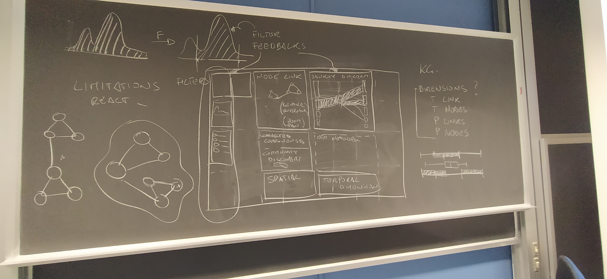

# Meeting notes

From the first discussion, we have identified a few key points to consider for our design.

## 1. Filter Feedback Loop

One side of the board (top or left, to be decided) shows a list of filtering options. The filtering may be based on node/edge attributes, temporal aspects, or other dimensions. A key aspect of the design is to provide immediate feedback on how the filters affect the graph. If the update is fast enough, we can show the transition from the original graph to the filtered one. If the filtering takes more time, we can provide a visual summary of the changes (e.g. the selection within a distribution, or the number of nodes/edges affected). The idea is to make the filtering process transparent and informative, giving an immediate feedback to the user about the impact of their actions.

Filters are directly linked to the data ingestion process, which is a crucial step in the workflow to have all the metadata necessary to the exploration.

The visual dashboard uses interactive filtering mechanisms to manage complex datasets:

*   **Data Distribution:** Initial global distributions (e.g., histograms) visualize the raw dataset, allowing users to identify patterns or outliers. 
*   **Filter Feedback Loop:** Users apply filters to these distributions to isolate specific subsets of data.
*   **Sidebar Controls:** A persistent user interface component that houses active filters. It allows users to dynamically adjust parameters and trigger real-time updates across all visualization panels (to be decides where to place it, top or left).

## 2. Visualization Grid
The core of the dashboard is a two-row modular grid offering multiple analytical perspectives:

*   **Node-Link Diagram:** The central graph view for topological exploration. It features interactive capabilities such as zooming, panning, and optimized rendering to handle large datasets. **Limitations**: may struggle with very large graphs, and may require additional techniques (e.g., clustering, edge bundling) to maintain readability.
*   **Sankey Diagram:** Visualizes flow, transitions, or the directional volume of relationships between entity categories within the Knowledge Graph. **Limitations**: may not be suitable for highly interconnected graphs or those with many categories, as it can become cluttered and difficult to interpret.
*   **Connected Components:** A dedicated view for community discovery, highlighting densely connected clusters or isolated subgraphs to reveal inherent network structures. **Limitations**: may not provide detailed insights into individual nodes or edges, and may require additional context to understand the significance of the identified communities. In alternative, community detection can be integrated.
*   **Ego Network:** A localized "neighborhood" view focusing on a specific central entity (the "Ego") and its direct connections (the "Alters"). This view allows users to explore the immediate context of a selected node, revealing its relationships and interactions within the graph. **Limitations**: may not capture broader network patterns or indirect relationships, and may require additional navigation to explore beyond the immediate neighborhood.
*   **Spatial View:** Maps graph elements to physical or geographic dimensions, useful for location-based analysis. **Limitations**: may not be applicable for all types of knowledge graphs, and may require accurate geospatial data to be effective. It should be made optional.
*   **Temporal Dimension:** Visualizes time-series data, tracking how the network, specific nodes, or relationships evolve over time. **Limitations**: may require a significant amount of temporal data to be meaningful, and filtering by time may require additional backend processing to maintain performance.

## 3. Knowledge Graph (KG) Dimensions
The system categorizes, filters, and analyzes the graph based on distinct structural and descriptive dimensions:

*   **T (Types):**
    *   **T Nodes (Node Type):** The categorical classification of an entity within the graph (e.g., *Person*, *Organization*, *Boat*, *Harbor*).
    *   **T Links (Link Type):** The nature or semantic definition of the relationship connecting entities (e.g., `WORKS_FOR`, `LOCATED_IN`, `DEPENDS_ON`).
*   **P (Properties):**
    *   **P Nodes (Node Properties):** The specific attributes or metadata attached to an entity. These property lists vary dynamically based on the Node Type (e.g., a *Person* node might have an `age` property, while an *Organization* node has a `revenue` property).
    *   **P Links (Link Properties):** The attributes defining a specific edge. These can include complex lists of properties that qualify the relationship, differing for each entity pair (e.g., `partOf`, `ownedBy`, `confidenceScore`, or `timestamp`).

These dimensions should be automatically extracted from the data ingestion process, and they form the basis for filtering, categorization, and analysis within the visual dashboard. 